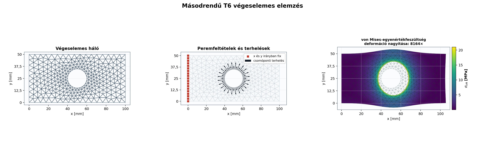

# PrimFEM

[English](README.md) | **Magyar**

[](https://github.com/primuszp/PrimFEM/actions/workflows/ci.yml)
[](https://www.python.org/)
[](pyproject.toml)
[](LICENSE)

Olvasható, validált és memóriahatékony kétdimenziós végeselemes könyvtár
Pythonhoz. A PrimFEM kis, következetes API-val kapcsolja össze a geometriát, a
hálózást, a lineáris rugalmassági modellt, a ritka megoldót és a tudományos
utófeldolgozást.

A projekt oktatási célú, de a numerikus megvalósítás mérnöki szemléletű:
ellenőrzött elemek, konzisztens peremterhek, ritka mátrixok, solverdiagnosztika,
klasszikus benchmarkok és ParaView-kompatibilis export tartozik hozzá.



Ez a README a teljes magyar projektútmutató. Egy helyen mutatja be a telepítést,
a publikus API-t, a hálózást, a megoldókat, a megjelenítést, a validációt és a
futtatható példákat.

## Miért PrimFEM?

- **Tanulható:** a fő numerikus lépések részletes magyar docstringet és
  kódmagyarázatot kaptak.
- **Egységes:** a strukturált és a Gmsh-háló ugyanazzal a `Mesh`–`Model`–
  `AnalysisResult` API-val használható.
- **Másodrendű:** a Triangle3 és Quad4 mellett teljes hatcsomópontos Triangle6
  (T6) elem is elérhető.
- **Memóriatakarékos:** a globális rendszer SciPy CSR ritka mátrix, a normál
  megoldási út közvetlenül a redukált rendszert állítja össze.
- **Hatékony terhelésvizsgálat:** a névvel ellátott terhelési esetek közös
  merevségi mátrixot és azonos kötöttségeknél közös ritka LU-faktorizációt használnak.
- **Együttműködő:** az opcionális meshio Gmsh, Nastran BDF, VTU, XDMF és
  további mérnöki hálóformátumokat kezel az alaptelepítés növelése nélkül.
- **Ellenőrzött:** a CI három Python-verzión futtatja a teszteket, a klasszikus
  FEM-benchmarkokat, a lintet és a csomagépítést.
- **Publikálható ábrák:** magyar és angol számformázás, mérnöki kitevők,
  mértékegységek és szabványos feszültségjelölések használhatók.

## Képességek

| Terület | Támogatás |
|---|---|
| Fizikai modell | 2D lineáris izotróp rugalmasság |
| Feltétel | síkfeszültség, síkalakváltozás |
| Elemek | Triangle3 (CST), Triangle6 (T6), Quad4 |
| Integrálás | T3 súlyponti, T6 7 pontos Dunavant, Q4 2×2 Gauss |
| Háló | strukturált T3/T6/Q4, modern Gmsh T3/T6/Q4 |
| Geometria | téglalap, sokszög, kör, körív, lyukak, helyi finomítás |
| Peremfeltétel | fix vagy előírt `ux`/`uy`, név szerinti teljes perem |
| Terhelés | csomóponti erő, teljes peremerő, traction, normális nyomás, testgyorsulás |
| Terhelésvizsgálat | névvel ellátott független esetek, csoportos megoldás, faktorizáció-újrahasználat |
| Mátrixtárolás | ritka COO-összeállítás, CSR-rendszer, redukált kötött mátrix |
| Solver | ritka direkt, Jacobi-előkondicionált CG, újrahasználható LU-faktorizáció |
| Eredmény | reakció, alakváltozás, feszültség, főfeszültség, von Mises |
| Megjelenítés | háló, peremek, támaszok, mezők, főirányok, ritka mátrix |
| Export/import | legacy VTK, meshio (Gmsh/BDF/VTU/XDMF), PROTUS és Myfem/FEMaster |
| Verifikáció | elemazonosságok, valamint patch-, konzol- és Cook-próba T3/T6/Q4 elemekre |

## Telepítés

Python 3.10 vagy újabb szükséges.

Telepítés közvetlenül a GitHub-projektből Gmsh támogatással:

```powershell
python -m pip install "primfem[gmsh] @ git+https://github.com/primuszp/PrimFEM.git"
```

Fejlesztői telepítés:

```powershell
git clone https://github.com/primuszp/PrimFEM.git
cd PrimFEM
python -m pip install -e ".[dev,gmsh]"
```

A Gmsh opcionális. Strukturált háló, megoldás, plot és VTK-export nélküle is
használható:

```powershell
python -m pip install -e .
```

A többformátumú háló-I/O külön vagy a Gmsh támogatással együtt telepíthető:

```powershell
python -m pip install -e ".[gmsh,io]"
```

## Gyors kezdés: Quad4 konzol

Egy elemzés öt lépése: háló, anyag, modell, peremfeltételek, megoldás.

```python
from primfem import LinearElasticMaterial, Model, PlotStyle, rectangular_quad_mesh

# 1. Geometria és strukturált háló [mm]
mesh = rectangular_quad_mesh(
    nx=20,
    ny=5,
    width=200.0,
    height=50.0,
)

# 2. Anyag [N, mm, MPa]
steel = LinearElasticMaterial(
    young_modulus=210_000.0,
    poisson_ratio=0.3,
    name="acél",
)

# 3. Öt milliméter vastag síkfeszültségi modell
model = Model(mesh, steel, thickness=5.0, name="Quad4 konzol")

# 4. Bal oldali befogás és összesen 1000 N függőleges csúcsterhelés
model.fix_boundary("left")
model.add_boundary_force("right", fy=-1_000.0)

# 5. Ritka megoldás és kiértékelés
result = model.solve()
print(result.summary())

style = PlotStyle(language="hu", length_unit="mm", stress_unit="MPa")
result.plot(
    field="nodal_von_mises",
    scale=result.suggested_deformation_scale(),
    style=style,
)
result.write_vtk("quad4_konzol.vtk")
```

A teljes futtatható változat: [`examples/cantilever_quad.py`](examples/cantilever_quad.py).

## Több terhelési eset

A `LoadCase` elválasztja a terheket és támaszokat a közös hálótól, anyagtól és
merevségtől. Azonos kötött szabadságfokoknál az esetek egy redukált mátrixot,
direkt megoldásnál pedig egyetlen ritka LU-faktorizációt használnak.

```python
model = Model(mesh, steel, thickness=5.0, name="konzol terhelési esetek")
model.fix_boundary("left")

vertical = model.load_case("függőleges")
vertical.add_boundary_force("right", fy=-1_000.0)

horizontal = model.load_case("vízszintes")
horizontal.add_boundary_force("right", fx=1_000.0)

results = model.solve_cases((vertical, horizontal), reuse_factorization=True)

for name, case_result in results.items():
    print(name, case_result.solver_info.factorization_reused)
```

Létrehozás után minden eset független. Az eltérő támaszkészletek automatikusan
külön mátrixcsoportba kerülnek. Teljes példa:
[`examples/load_cases.py`](examples/load_cases.py).

## T6 hálózás Gmsh segítségével

A PrimFEM közvetlenül a Gmsh Python API-ját használja; nem készít köztes `.geo`
vagy `.inp` fájlt. A geometriai peremnevek a hálózás után is megmaradnak, ezért
a modell nem függ csomópontszámoktól.

```python
from primfem import Geometry2D, GmshMesher, LinearElasticMaterial, Model, PlotStyle

# Téglalap kör alakú furattal és helyi hálófinomítással
geometry = (
    Geometry2D("furatos lemez")
    .add_rectangle(width=100.0, height=50.0)
    .add_circle(
        center=(50.0, 25.0),
        radius=10.0,
        boundary="hole",
        mesh_size=3.0,
    )
)

# order=2: hatcsomópontos, görbült oldalú Triangle6 háló
mesh = GmshMesher(
    element_size=6.0,
    element_shape="triangle",
    order=2,
).generate(geometry)

model = Model(
    mesh,
    LinearElasticMaterial(210_000.0, 0.3),
    thickness=5.0,
    name="nyomás alatt álló furatos lemez",
)
model.fix_boundary("left")
model.add_boundary_pressure("hole", pressure=10.0)

result = model.solve()
style = PlotStyle(language="hu", length_unit="mm", stress_unit="MPa")

mesh.plot(style=style)
model.plot_boundary_conditions(style=style)
result.plot(
    field="nodal_von_mises",
    scale=result.suggested_deformation_scale(),
    style=style,
)
```

A T6 csomópontsorrendje `(1, 2, 3, 12, 23, 31)`. A görbült T6 peremek
traction- és nyomásterhelése hárompontos vonalmenti Gauss-integrálással készül.

A teljes kétnyelvű példa:
[`examples/t6_localized_plots.py`](examples/t6_localized_plots.py).

### Strukturált T6 háló Gmsh nélkül

```python
from primfem import rectangular_t6_mesh

mesh = rectangular_t6_mesh(nx=10, ny=4, width=100.0, height=40.0)
```

Meglévő, kizárólag Triangle3 elemekből álló háló másodrendűvé emelhető:

```python
from primfem import to_quadratic_tri_mesh

t6_mesh = to_quadratic_tri_mesh(triangle3_mesh)
```

## Peremfeltételek és terhek

A strukturált téglalaphálók és a Gmsh-hálók egyaránt névvel ellátott
peremeket adnak, ezért a modell független a csomópontszámozástól és a
hálófinomítástól. A téglalaphálók automatikus nevei: `bottom`, `right`,
`top`, `left`.

```python
# Egy csomópont vagy csomópontlista
model.fix_node(0)                              # ux = uy = 0
model.fix_node(1, x=True, y=False)            # csak ux = 0
model.prescribe(2, ux=0.05)                   # vezérelt elmozdulás

# Teljes elnevezett perem
model.fix_boundary("left")
model.fix_boundary("bottom", x=False, y=True)
model.prescribe_boundary("right", ux=0.05)

# Erők és gyorsulás
model.add_nodal_load(node=10, fx=100.0, fy=-50.0)
model.add_boundary_force("right", fy=-1_000.0)  # teljes eredő [erő]
model.add_boundary_traction("right", tx=2.0, ty=-1.0)
model.add_boundary_pressure("hole", pressure=10.0)  # pozitív: a testbe mutat
model.set_body_acceleration(ay=-9.81)
```

Az `add_boundary_force()` teljes eredőt fogad és a perem hálósűrűségétől
függetlenül, konzisztensen osztja el. A traction és a nyomás erő/felület
dimenziójú; a modell vastagsága az integrálás része. Testgyorsuláshoz az
anyag `density` értékét is meg kell adni.

Peremek és peremfeltételek ellenőrzése:

```python
print(mesh.boundary_names)
left_nodes = mesh.boundary_nodes("left")
hole_edges = mesh.boundary_edges("hole")
right_length = mesh.boundary_length("right")

mesh.plot_boundaries(names=["left", "hole"], style=style)
model.plot_boundary_conditions(style=style)
```

## Tudományos és lokalizált plotok

A `PlotStyle` minden PrimFEM-ábrán ugyanazt a nyelvet, mértékegységet és
számformázást alkalmazza.

```python
from primfem import PlotStyle

hu = PlotStyle(language="hu", length_unit="mm", stress_unit="MPa")
en = PlotStyle(language="en", length_unit="mm", stress_unit="MPa")

result.plot(field="displacement_magnitude", style=hu)
result.plot(field="nodal_stress_x", style=hu)
result.plot(field="nodal_von_mises", style=en)
result.plot_principal_directions(stride=2, style=hu)
```

- magyar módban `12,5`, angol módban `12.5` jelenik meg;
- a feszültségmezők szabványos `σₓ`, `σᵧ`, `τₓᵧ`, `σ₁`, `σ₂`, `σᵥM`
  jelölést kapnak;
- nagy és kis értékeknél közös `10^(3n)` mérnöki kitevő jelenik meg;
- előjeles mezők nullaközepű divergens, von Mises-értékek szekvenciális
  színskálát használnak;
- a színskála magassága a diagram rajztéglalapjához igazodik.

Elérhető mezőnevek:

| Mező | Jelentés |
|---|---|
| `displacement_magnitude` | elmozdulásvektor nagysága |
| `displacement_x`, `displacement_y` | elmozduláskomponensek |
| `stress_x`, `stress_y`, `stress_xy` | elemközépi feszültségkomponensek |
| `von_mises` | elemközépi von Mises-feszültség |
| `nodal_stress_x`, `nodal_stress_y`, `nodal_stress_xy` | simított csomóponti feszültségek |
| `nodal_von_mises` | csomóponti von Mises-feszültség |
| `principal_stress_1`, `principal_stress_2` | csomóponti főfeszültségek |

## Ritka solver és mátrixdiagnosztika

A `solve()` alapértelmezett `auto` módja kisebb rendszernél ritka direkt,
nagyobb rendszernél Jacobi-előkondicionált CG-megoldót választ.

```python
from primfem import SolverOptions

# Automatikus solver
result = model.solve()

# Explicit ritka direkt megoldás
result = model.solve("direct")

# Memóriatakarékos iteratív megoldás
result = model.solve(
    SolverOptions(
        method="cg",
        preconditioner="jacobi",
        relative_tolerance=1e-10,
        max_iterations=20_000,
    )
)

print(result.solver_info.method)
print(result.solver_info.iterations)
print(result.solver_info.relative_residual)
print(result.solver_info.matrix_memory_megabytes)
```

A merevségi mátrix sűrűvé alakítás nélkül vizsgálható:

```python
K = model.stiffness_matrix()
Kff = model.stiffness_matrix(reduced=True)

model.plot_stiffness_matrix(kind="sparsity", style=hu)
model.plot_stiffness_matrix(kind="magnitude", reduced=True, style=hu)
```

Nagy mátrixnál az ábrázoló determinisztikus mintavételezéssel korlátozza a
kirajzolt nemnulla bejegyzések számát. Részletes példa:
[`examples/sparse_matrix_visualization.py`](examples/sparse_matrix_visualization.py).

## Eredmények és VTK-export

```python
result.displacement                 # (node_count, 2): ux, uy
result.displacement_magnitude       # (node_count,)
result.reaction                     # (node_count, 2): Rx, Ry

result.strain                       # (element_count, 3): ex, ey, gamma_xy
result.stress                       # (element_count, 3): sx, sy, tau_xy
result.von_mises                    # (element_count,)
result.principal_stress             # (element_count, 2)

result.integration_point_strain     # elemenként minden Gauss-pont
result.integration_point_stress
result.integration_point_von_mises

result.nodal_strain                 # extrapolált és elemközileg átlagolt
result.nodal_stress
result.nodal_von_mises
result.nodal_principal_stress
result.nodal_principal_angle
```

ParaView-kompatibilis legacy VTK-fájl:

```python
path = result.write_vtk("eredmeny.vtk")
print(path)
```

Az export tartalmazza a háló eredeti T3/T6/Q4 cellatípusát, az elmozdulást,
reakciót, csomóponti és elemmezőket, főfeszültségi vektorokat és a külön
integrációsponti eredményeket.

### Többformátumú hálócsere

Az opcionális `io` extra a meshio segítségével Gmsh, Nastran BDF, VTU, XDMF és
sok további formátumot támogat. A beolvasott háló ugyanazokon a PrimFEM-
ellenőrzéseken megy át, a névvel ellátott Gmsh fizikai görbék pedig névvel
ellátott PrimFEM-peremmé alakulnak.

```python
from primfem import Mesh

mesh = Mesh.read("plate.msh")
mesh.write("plate.vtu")

result = model.solve()
result.write("teljes_eredmeny.vtu")
```

A függőségmentes `result.write_vtk(...)` továbbra is rendelkezésre áll az
ember által olvasható legacy VTK kimenethez.

## Klasszikus verifikáció

```python
from primfem import run_classic_validations

report = run_classic_validations()
print(report.summary())
report.write_markdown("validation.md")
report.plot()

assert report.passed
```

Az elemek matematikai azonosságai szerkezeti benchmark nélkül is ellenőrizhetők:

```python
from primfem import verify_supported_elements

for element_report in verify_supported_elements(sample_count=50):
    print(element_report.summary())
    element_report.raise_for_failure()
```

Az ellenőrzés vizsgálja a partícióegységet, a zérus gradiensösszeget, az
alakfüggvények numerikus deriváltját és a referenciakoordináták pontos
leképezését.

A kilenc beépített eset három feladatot vizsgál Triangle3, Triangle6 és Quad4
elemmel:

1. egytengelyű patch-próba egzakt homogén mezővel;
2. karcsú konzol Timoshenko-referenciával;
3. torzításérzékeny Cook-membrán konvergenciasorral.

Az aktuális T6 eredmények:

| Feladat | Relatív hiba |
|---|---:|
| patch-próba | `7,143e-13` |
| karcsú konzol | `0,2232%` |
| Cook-membrán | `0,03256%` |

## Kompatibilitási import

```python
from primfem import load_myfem, load_protus

myfem_model = load_myfem("model.fem")
myfem_result = myfem_model.solve()

protus_model = load_protus("INPUT_FEA_PROTUS.txt")
protus_result = protus_model.solve()
```

Az importerek az egytől induló régi számozást automatikusan a PrimFEM nullától
induló indexeire alakítják. Az új számítás már a ritka megoldót használja.

## Futtatható példák

| Példa | Bemutatott funkció | Gmsh |
|---|---|---:|
| [`cantilever_quad.py`](examples/cantilever_quad.py) | minimális Quad4 elemzés és VTK | nem |
| [`gmsh_plate_with_hole.py`](examples/gmsh_plate_with_hole.py) | furatos Triangle3 háló | igen |
| [`gmsh_quad_mesh.py`](examples/gmsh_quad_mesh.py) | rekombinált Quad4 háló és peremek | igen |
| [`t6_localized_plots.py`](examples/t6_localized_plots.py) | T6, nyomás, magyar/angol plot | igen |
| [`boundary_conditions.py`](examples/boundary_conditions.py) | irányonkénti megtámasztások | igen |
| [`pressurized_hole.py`](examples/pressurized_hole.py) | normális furatnyomás | igen |
| [`colored_cantilever.py`](examples/colored_cantilever.py) | teljes eredménygaléria | nem |
| [`sparse_matrix_visualization.py`](examples/sparse_matrix_visualization.py) | CSR-memória és solverdiagnosztika | nem |
| [`validate_classic_fem.py`](examples/validate_classic_fem.py) | kilenc benchmark futtatása | nem |
| [`load_cases.py`](examples/load_cases.py) | több terhelési eset és megosztott ritka faktorizáció | nem |
| [`element_checks.py`](examples/element_checks.py) | általános T3/T6/Q4 matematikai ellenőrzések | nem |
| [`protus_compat.py`](examples/protus_compat.py) | PROTUS-import | nem |
| [`triangle_from_myfem.py`](examples/triangle_from_myfem.py) | Myfem/FEMaster-import | nem |

## Projektstruktúra

- `primfem/elements.py`: alakfüggvények, `B` mátrix, merevség és tömeg;
- `primfem/boundary.py`: közös lineáris és kvadratikus peremintegrálás;
- `primfem/model.py`: ritka összeállítás, peremfeltételek és megoldás;
- `primfem/plotting.py`: lokalizált tudományos vizualizáció;
- `examples/`: futtatható hálózási, elemzési, ábrázolási és validációs példák;
- `tests/test_primfem.py`: numerikus, API-, Gmsh- és regressziós tesztek.

## Fejlesztés és ellenőrzés

```powershell
python -m pip install -e ".[dev,gmsh]"
python -m ruff check primfem tests examples
python -m ruff format --check primfem tests examples
python -m pytest
python -m build
```

A GitHub Actions ugyanezt Python 3.10, 3.11 és 3.12 alatt hajtja végre.

## Mértékegységek

A PrimFEM nem kényszerít mértékegységrendszert. Minden bemenetet egyetlen
konzisztens rendszerben kell megadni. Például N–mm rendszerben:

- geometria és elmozdulás: `mm`;
- erő: `N`;
- Young-modulus és feszültség: `N/mm² = MPa`;
- síkbeli traction és nyomás: `N/mm²`;
- vastagság: `mm`.

A `PlotStyle` csak megjeleníti a megadott egységnevet; nem végez
mértékegység-konverziót.

## Jelenlegi korlátok

A PrimFEM szándékosan átlátható lineáris statikai könyvtár. Jelenleg modellenként
egy izotróp anyagot és egy vastagságot kezel. Nincs kontakt, képlékenység,
geometriai nemlinearitás, törés, dinamikai időintegrálás vagy ipari
minőségbiztosítás. Biztonságkritikus mérnöki döntés előtt független
ellenőrzés és megfelelő szabvány szerinti validáció szükséges.

## Licenc

[MIT](LICENSE) © Primusz Péter
