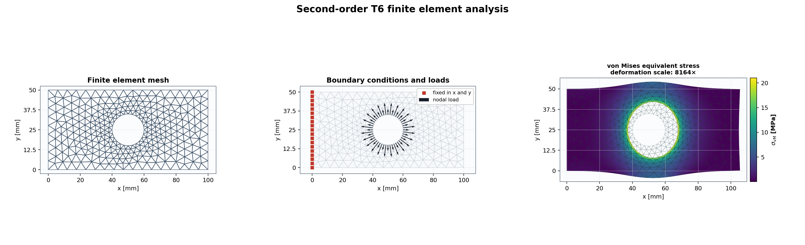

# PrimFEM

**English** | [Magyar](README.hu.md)

[](https://github.com/primuszp/PrimFEM/actions/workflows/ci.yml)
[](https://www.python.org/)
[](pyproject.toml)
[](LICENSE)

A readable, validated, and memory-efficient two-dimensional finite element
library for Python. PrimFEM connects geometry, meshing, linear elasticity,
sparse solvers, and scientific post-processing through a small, consistent
API.

PrimFEM is designed for teaching, but its numerical implementation follows
sound engineering practice: verified elements, consistent boundary loads,
sparse matrices, solver diagnostics, classical benchmarks, and
ParaView-compatible export are included.



This README is the primary project guide. It covers installation, the public
API, meshing, solvers, visualization, validation, and runnable examples in one
place.

## Why PrimFEM?

- **Easy to learn:** the numerical stages are kept explicit and the code is
  documented in detail.
- **Consistent:** structured and Gmsh meshes use the same `Mesh`–`Model`–
  `AnalysisResult` workflow.
- **Second-order capable:** Triangle6 (T6) is available alongside Triangle3
  and Quad4.
- **Memory-efficient:** the global system is stored as a SciPy CSR sparse
  matrix, and the standard solve path assembles the reduced system directly.
- **Efficient load studies:** named load cases share the stiffness matrix and
  can reuse a sparse LU factorization when their constrained DOFs match.
- **Interoperable:** optional meshio exchange covers Gmsh, Nastran BDF, VTU,
  XDMF, and other engineering mesh formats without burdening the core install.
- **Verified:** continuous integration tests the library, classical FEM
  benchmarks, formatting, and package build on three Python versions.
- **Publication-ready plots:** English and Hungarian number formatting,
  engineering exponents, physical units, and standard stress symbols are
  supported.

## Capabilities

| Area | Support |
|---|---|
| Physical model | 2D linear isotropic elasticity |
| Assumptions | plane stress, plane strain |
| Elements | Triangle3 (CST), Triangle6 (T6), Quad4 |
| Integration | T3 centroid, T6 7-point Dunavant, Q4 2×2 Gauss |
| Meshes | structured T3/T6/Q4, modern Gmsh T3/T6/Q4 |
| Geometry | rectangles, polygons, circles, arcs, holes, local refinement |
| Constraints | fixed or prescribed `ux`/`uy`, complete named boundaries |
| Loads | nodal force, traction, normal pressure, body acceleration |
| Load studies | named independent cases, grouped solution, reusable factorization |
| Matrix storage | sparse COO assembly, CSR systems, reduced constrained matrices |
| Solvers | sparse direct, Jacobi-preconditioned CG, reusable LU factorization |
| Results | reaction, strain, stress, principal stress, von Mises stress |
| Visualization | mesh, boundaries, supports, fields, principal directions, sparse matrices |
| Import/export | legacy VTK, meshio (Gmsh/BDF/VTU/XDMF), PROTUS and Myfem/FEMaster |
| Verification | element identities plus patch, cantilever, and Cook benchmarks for T3/T6/Q4 |

## Installation

PrimFEM requires Python 3.10 or newer.

Install directly from GitHub with optional Gmsh support:

```powershell
python -m pip install "primfem[gmsh] @ git+https://github.com/primuszp/PrimFEM.git"
```

For development:

```powershell
git clone https://github.com/primuszp/PrimFEM.git
cd PrimFEM
python -m pip install -e ".[dev,gmsh]"
```

Gmsh is optional. Structured meshing, solving, plotting, and VTK export work
without it:

```powershell
python -m pip install -e .
```

Install the optional multi-format mesh I/O separately or together with Gmsh:

```powershell
python -m pip install -e ".[gmsh,io]"
```

## Quick start: a Quad4 cantilever

A complete analysis has five clear stages: mesh, material, model, boundary
conditions, and solution.

```python
from primfem import LinearElasticMaterial, Model, PlotStyle, rectangular_quad_mesh

# 1. Geometry and structured mesh [mm]
mesh = rectangular_quad_mesh(
    nx=20,
    ny=5,
    width=200.0,
    height=50.0,
)

# 2. Material [N, mm, MPa]
steel = LinearElasticMaterial(
    young_modulus=210_000.0,
    poisson_ratio=0.3,
    name="steel",
)

# 3. Plane-stress model with a thickness of 5 mm
model = Model(mesh, steel, thickness=5.0, name="Quad4 cantilever")

# 4. Clamp the left edge and apply a total vertical tip load of 1000 N
model.fix_nodes(mesh.nodes_where(x=0.0))
right_nodes = mesh.nodes_where(x=200.0)
model.add_nodal_loads(right_nodes, fy=-1_000.0 / len(right_nodes))

# 5. Sparse solution and post-processing
result = model.solve()
print(result.summary())

style = PlotStyle(language="en", length_unit="mm", stress_unit="MPa")
result.plot(
    field="nodal_von_mises",
    scale=result.suggested_deformation_scale(),
    style=style,
)
result.write_vtk("quad4_cantilever.vtk")
```

See [`examples/cantilever_quad.py`](examples/cantilever_quad.py) for the
complete runnable version.

## Multiple load cases

`LoadCase` separates loads and constraints from the shared mesh, material, and
stiffness. Cases with the same constrained degrees of freedom share one
reduced matrix and, with the direct solver, one sparse LU factorization.

```python
model = Model(mesh, steel, thickness=5.0, name="cantilever load cases")
model.fix_nodes(mesh.nodes_where(x=0.0))
right_nodes = mesh.nodes_where(x=200.0)

vertical = model.load_case("vertical")
vertical.add_nodal_loads(right_nodes, fy=-1_000.0 / len(right_nodes))

horizontal = model.load_case("horizontal")
horizontal.add_nodal_loads(right_nodes, fx=1_000.0 / len(right_nodes))

results = model.solve_cases((vertical, horizontal), reuse_factorization=True)

for name, case_result in results.items():
    print(name, case_result.solver_info.factorization_reused)
```

Each case is independent after creation. Different support layouts are
automatically placed in separate matrix groups. See
[`examples/load_cases.py`](examples/load_cases.py).

## T6 meshing with Gmsh

PrimFEM calls the Gmsh Python API directly; no intermediate `.geo` or `.inp`
file is required. Geometric boundary names survive meshing, so the model does
not depend on node numbering.

```python
from primfem import Geometry2D, GmshMesher, LinearElasticMaterial, Model, PlotStyle

# A rectangular plate with a circular hole and local mesh refinement
geometry = (
    Geometry2D("plate with hole")
    .add_rectangle(width=100.0, height=50.0)
    .add_circle(
        center=(50.0, 25.0),
        radius=10.0,
        boundary="hole",
        mesh_size=3.0,
    )
)

# order=2 creates six-node Triangle6 elements with curved edges
mesh = GmshMesher(
    element_size=6.0,
    element_shape="triangle",
    order=2,
).generate(geometry)

model = Model(
    mesh,
    LinearElasticMaterial(210_000.0, 0.3),
    thickness=5.0,
    name="pressurized plate with hole",
)
model.fix_boundary("left")
model.add_boundary_pressure("hole", pressure=10.0)

result = model.solve()
style = PlotStyle(language="en", length_unit="mm", stress_unit="MPa")

mesh.plot(style=style)
model.plot_boundary_conditions(style=style)
result.plot(
    field="nodal_von_mises",
    scale=result.suggested_deformation_scale(),
    style=style,
)
```

T6 uses the node order `(1, 2, 3, 12, 23, 31)`. Traction and pressure on
curved T6 boundaries are integrated using three-point line Gauss quadrature.

The full bilingual example is
[`examples/t6_localized_plots.py`](examples/t6_localized_plots.py).

### Structured T6 mesh without Gmsh

```python
from primfem import rectangular_t6_mesh

mesh = rectangular_t6_mesh(nx=10, ny=4, width=100.0, height=40.0)
```

An existing all-Triangle3 mesh can also be upgraded to second order:

```python
from primfem import to_quadratic_tri_mesh

t6_mesh = to_quadratic_tri_mesh(triangle3_mesh)
```

## Boundary conditions and loads

Named Gmsh boundaries keep model definitions independent of mesh refinement.

```python
# One node or a list of nodes
model.fix_node(0)                              # ux = uy = 0
model.fix_node(1, x=True, y=False)            # ux = 0 only
model.prescribe(2, ux=0.05)                   # prescribed displacement

# Complete named boundaries
model.fix_boundary("left")
model.fix_boundary("bottom", x=False, y=True)
model.prescribe_boundary("right", ux=0.05)

# Forces and acceleration
model.add_nodal_load(node=10, fx=100.0, fy=-50.0)
model.add_boundary_traction("right", tx=2.0, ty=-1.0)
model.add_boundary_pressure("hole", pressure=10.0)  # positive points inward
model.set_body_acceleration(ay=-9.81)
```

Traction and pressure have the dimensions of force per area; model thickness
is included during integration. Body acceleration also requires `density` in
the material definition.

Inspect named boundaries and constraints before solving:

```python
print(mesh.boundary_names)
left_nodes = mesh.boundary_nodes("left")
hole_edges = mesh.boundary_edges("hole")

mesh.plot_boundaries(names=["left", "hole"], style=style)
model.plot_boundary_conditions(style=style)
```

## Scientific and localized plots

`PlotStyle` applies one language, unit system, and number format consistently
to every PrimFEM figure.

```python
from primfem import PlotStyle

hu = PlotStyle(language="hu", length_unit="mm", stress_unit="MPa")
en = PlotStyle(language="en", length_unit="mm", stress_unit="MPa")

result.plot(field="displacement_magnitude", style=hu)
result.plot(field="nodal_stress_x", style=hu)
result.plot(field="nodal_von_mises", style=en)
result.plot_principal_directions(stride=2, style=hu)
```

- Hungarian mode displays `12,5`; English mode displays `12.5`.
- Stress fields use the conventional `σₓ`, `σᵧ`, `τₓᵧ`, `σ₁`, `σ₂`, and
  `σᵥM` symbols.
- Very large and small values share a `10^(3n)` engineering exponent.
- Signed fields use zero-centered diverging color maps; von Mises fields use
  sequential color maps.
- The color bar height is constrained to the chart's drawing rectangle.

Available result field names:

| Field | Meaning |
|---|---|
| `displacement_magnitude` | displacement vector magnitude |
| `displacement_x`, `displacement_y` | displacement components |
| `stress_x`, `stress_y`, `stress_xy` | element-center stress components |
| `von_mises` | element-center von Mises stress |
| `nodal_stress_x`, `nodal_stress_y`, `nodal_stress_xy` | recovered nodal stresses |
| `nodal_von_mises` | nodal von Mises stress |
| `principal_stress_1`, `principal_stress_2` | nodal principal stresses |

## Sparse solvers and matrix diagnostics

The default `auto` mode uses a sparse direct solver for smaller systems and a
Jacobi-preconditioned conjugate-gradient solver for larger systems.

```python
from primfem import SolverOptions

# Automatic solver selection
result = model.solve()

# Explicit sparse direct solution
result = model.solve("direct")

# Memory-efficient iterative solution
result = model.solve(
    SolverOptions(
        method="cg",
        preconditioner="jacobi",
        relative_tolerance=1e-10,
        max_iterations=20_000,
    )
)

print(result.solver_info.method)
print(result.solver_info.iterations)
print(result.solver_info.relative_residual)
print(result.solver_info.matrix_memory_megabytes)
```

Inspect the stiffness matrix without converting it to a dense array:

```python
K = model.stiffness_matrix()
Kff = model.stiffness_matrix(reduced=True)

model.plot_stiffness_matrix(kind="sparsity", style=en)
model.plot_stiffness_matrix(kind="magnitude", reduced=True, style=en)
```

For large matrices, deterministic sampling limits the number of nonzero
entries drawn. See
[`examples/sparse_matrix_visualization.py`](examples/sparse_matrix_visualization.py).

## Results and VTK export

```python
result.displacement                 # (node_count, 2): ux, uy
result.displacement_magnitude       # (node_count,)
result.reaction                     # (node_count, 2): Rx, Ry

result.strain                       # (element_count, 3): ex, ey, gamma_xy
result.stress                       # (element_count, 3): sx, sy, tau_xy
result.von_mises                    # (element_count,)
result.principal_stress             # (element_count, 2)

result.integration_point_strain     # every Gauss point of each element
result.integration_point_stress
result.integration_point_von_mises

result.nodal_strain                 # extrapolated and averaged over elements
result.nodal_stress
result.nodal_von_mises
result.nodal_principal_stress
result.nodal_principal_angle
```

Write a ParaView-compatible legacy VTK file:

```python
path = result.write_vtk("result.vtk")
print(path)
```

The export preserves the original T3/T6/Q4 cell type and includes
displacements, reactions, nodal and element fields, principal-stress vectors,
and separate integration-point results.

### Multi-format mesh exchange

With the optional `io` extra, meshio adds Gmsh, Nastran BDF, VTU, XDMF, and
many other formats. Imported meshes still pass PrimFEM's geometry checks, and
named Gmsh physical curves become named PrimFEM boundaries.

```python
from primfem import Mesh

mesh = Mesh.read("plate.msh")
mesh.write("plate.vtu")

result = model.solve()
result.write("complete_result.vtu")
```

The dependency-free `result.write_vtk(...)` method remains available for
human-readable legacy VTK output.

## Classical verification

```python
from primfem import run_classic_validations

report = run_classic_validations()
print(report.summary())
report.write_markdown("validation.md")
report.plot()

assert report.passed
```

The element implementations can also verify their mathematical identities
independently of a structural benchmark:

```python
from primfem import verify_supported_elements

for element_report in verify_supported_elements(sample_count=50):
    print(element_report.summary())
    element_report.raise_for_failure()
```

These checks cover partition of unity, zero gradient sum, numerical shape-
function derivatives, and exact reference-coordinate mapping.

The nine built-in cases evaluate three problems with Triangle3, Triangle6,
and Quad4 elements:

1. a uniaxial patch test with an exact homogeneous field;
2. a slender cantilever with a Timoshenko reference solution;
3. a distortion-sensitive Cook's membrane convergence series.

Current T6 results:

| Problem | Relative error |
|---|---:|
| patch test | `7.143e-13` |
| slender cantilever | `0.2232%` |
| Cook's membrane | `0.03256%` |

## Compatibility import

```python
from primfem import load_myfem, load_protus

myfem_model = load_myfem("model.fem")
myfem_result = myfem_model.solve()

protus_model = load_protus("INPUT_FEA_PROTUS.txt")
protus_result = protus_model.solve()
```

Importers automatically convert legacy one-based numbering to PrimFEM's
zero-based indices. The imported analysis then uses the sparse solver.

## Runnable examples

| Example | Demonstrated feature | Gmsh |
|---|---|---:|
| [`cantilever_quad.py`](examples/cantilever_quad.py) | minimal Quad4 analysis and VTK | no |
| [`gmsh_plate_with_hole.py`](examples/gmsh_plate_with_hole.py) | Triangle3 plate-with-hole mesh | yes |
| [`gmsh_quad_mesh.py`](examples/gmsh_quad_mesh.py) | recombined Quad4 mesh and boundaries | yes |
| [`t6_localized_plots.py`](examples/t6_localized_plots.py) | T6, pressure, English/Hungarian plots | yes |
| [`boundary_conditions.py`](examples/boundary_conditions.py) | directional supports | yes |
| [`pressurized_hole.py`](examples/pressurized_hole.py) | normal pressure on a hole | yes |
| [`colored_cantilever.py`](examples/colored_cantilever.py) | complete result gallery | no |
| [`sparse_matrix_visualization.py`](examples/sparse_matrix_visualization.py) | CSR memory and solver diagnostics | no |
| [`validate_classic_fem.py`](examples/validate_classic_fem.py) | nine benchmark cases | no |
| [`load_cases.py`](examples/load_cases.py) | multiple load cases and reused sparse factorization | no |
| [`element_checks.py`](examples/element_checks.py) | general T3/T6/Q4 mathematical checks | no |
| [`protus_compat.py`](examples/protus_compat.py) | PROTUS import | no |
| [`triangle_from_myfem.py`](examples/triangle_from_myfem.py) | Myfem/FEMaster import | no |

## Project structure

- `primfem/elements.py`: shape functions, `B` matrices, stiffness, and mass;
- `primfem/model.py`: sparse assembly, boundary conditions, and solution;
- `primfem/plotting.py`: localized scientific visualization;
- `examples/`: runnable meshing, analysis, plotting, and validation programs;
- `tests/test_primfem.py`: numerical, API, Gmsh, and regression tests.

## Development and quality checks

```powershell
python -m pip install -e ".[dev,gmsh]"
python -m ruff check primfem tests examples
python -m ruff format --check primfem tests examples
python -m pytest
python -m build
```

GitHub Actions performs the same checks on Python 3.10, 3.11, and 3.12.

## Units

PrimFEM does not impose a unit system. All inputs must use one consistent
system. For example, in an N–mm system:

- geometry and displacement: `mm`;
- force: `N`;
- Young's modulus and stress: `N/mm² = MPa`;
- in-plane traction and pressure: `N/mm²`;
- thickness: `mm`.

`PlotStyle` displays the supplied unit label; it does not convert units.

## Current limitations

PrimFEM is intentionally a transparent linear-static library. A model currently
uses one isotropic material and one thickness. Contact, plasticity, geometric
nonlinearity, fracture, dynamic time integration, and industrial quality
assurance are outside the present scope. Safety-critical engineering decisions
require independent verification and validation against the applicable
standards.

## License

[MIT](LICENSE) © Péter Primusz
